# 🎮 Lingua Quest — AI-Powered Language Learning Adventure for iOS 🌍✨

<p align="center">
  
  
  
  
  
  
  
</p>

---

## 📖 Overview

**Lingua Quest** is an advanced, gamified iOS language learning platform that combines **RPG adventure progression**, **generative AI models**, **on-device computer vision**, **speech recognition**, and **iOS Lock Screen Live Activities**. 

The app features a hybrid architecture: structured curricula and user progressions are powered by a **RESTful Backend API**, while open-ended conversational games, vocabulary generation, and interactive voice labs communicate directly with **Generative AI Services (Gemini / DeepSeek / Speech Frameworks)** and **SwiftData local storage**.

---

## 🎬 Demo & Screenshots

<div align="center">
  <video src="./Screenshots/demo.mp4" width="250" controls></video>
</div>

### 📸 App Gallery

<p align="center">
  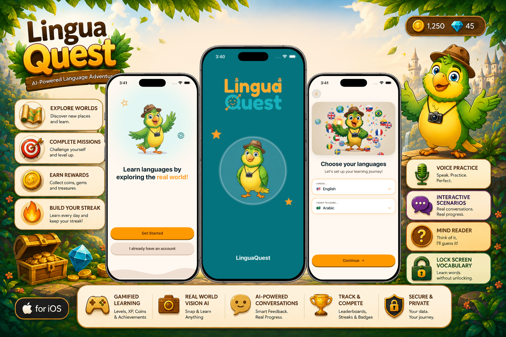
  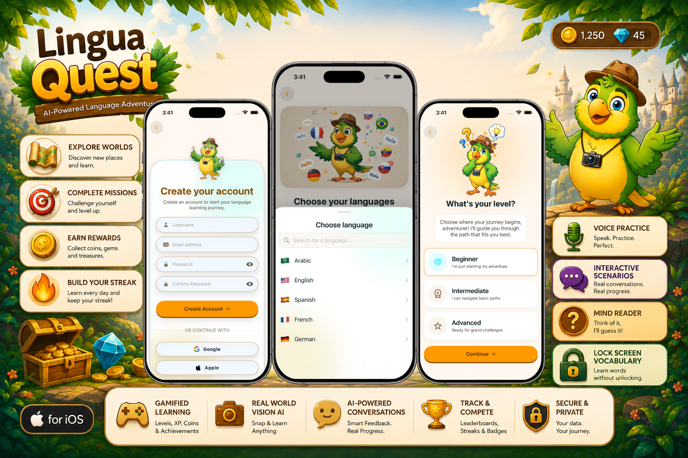
  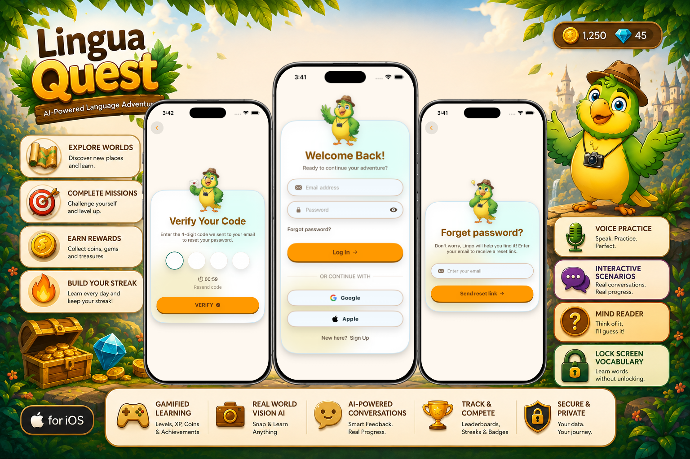
  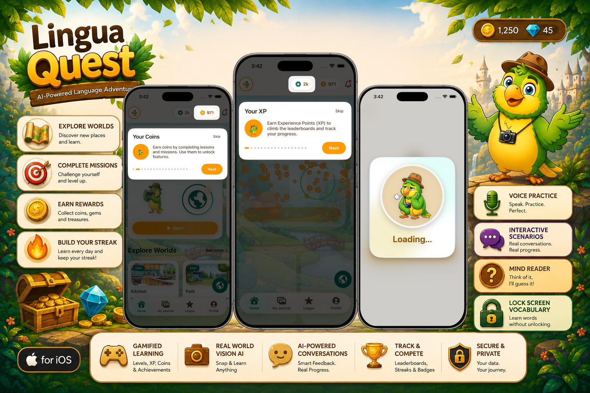
</p>
<p align="center">
  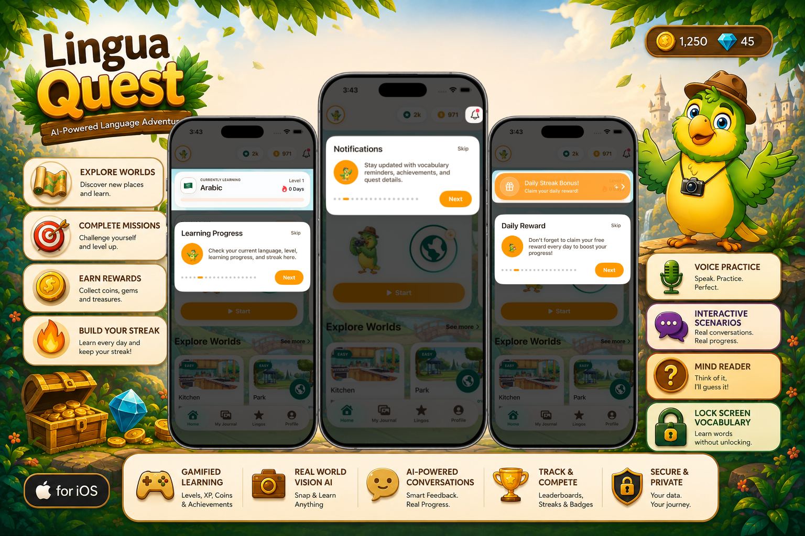
  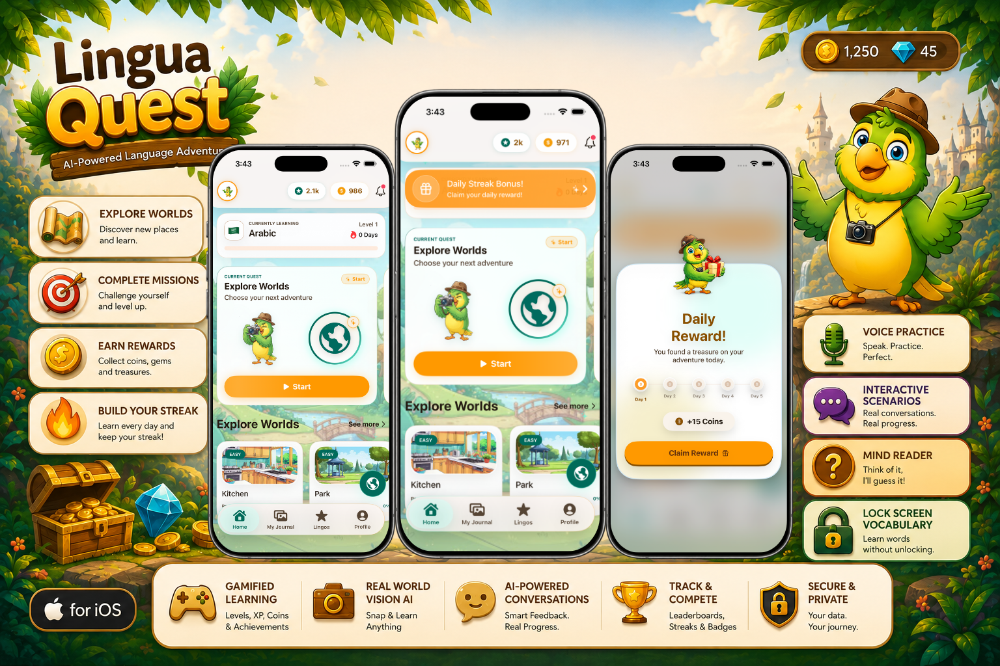
  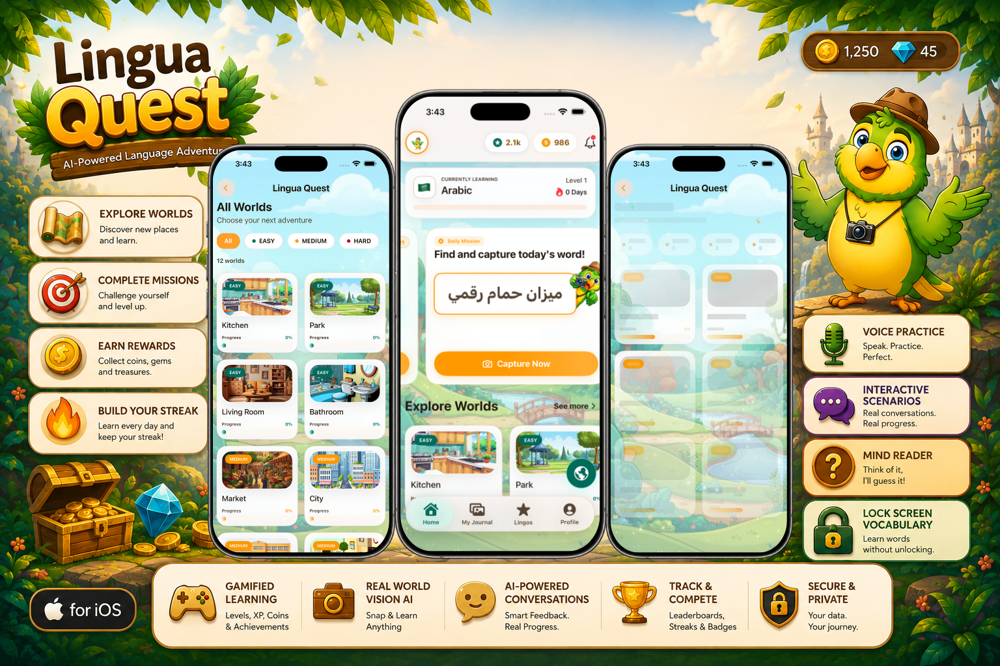
  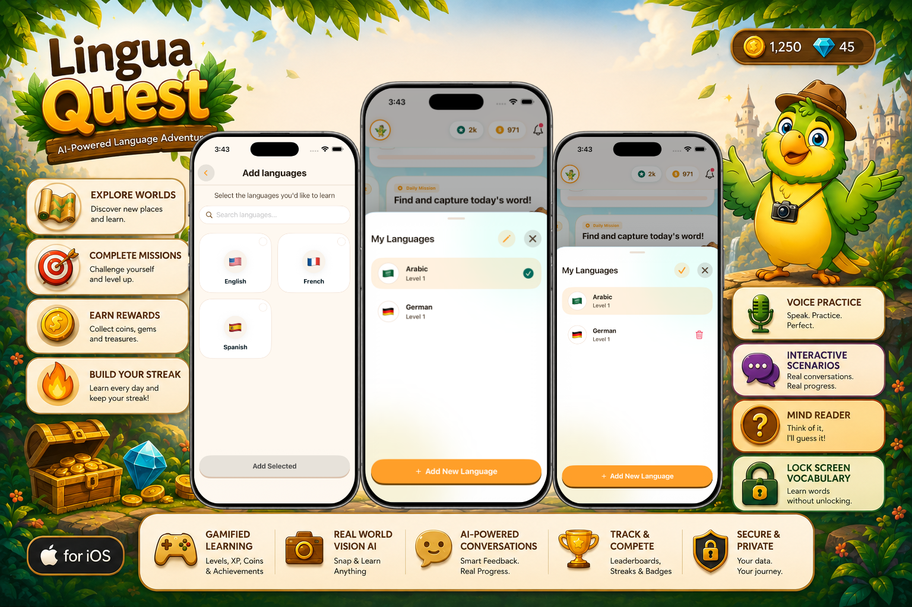
</p>
<p align="center">
  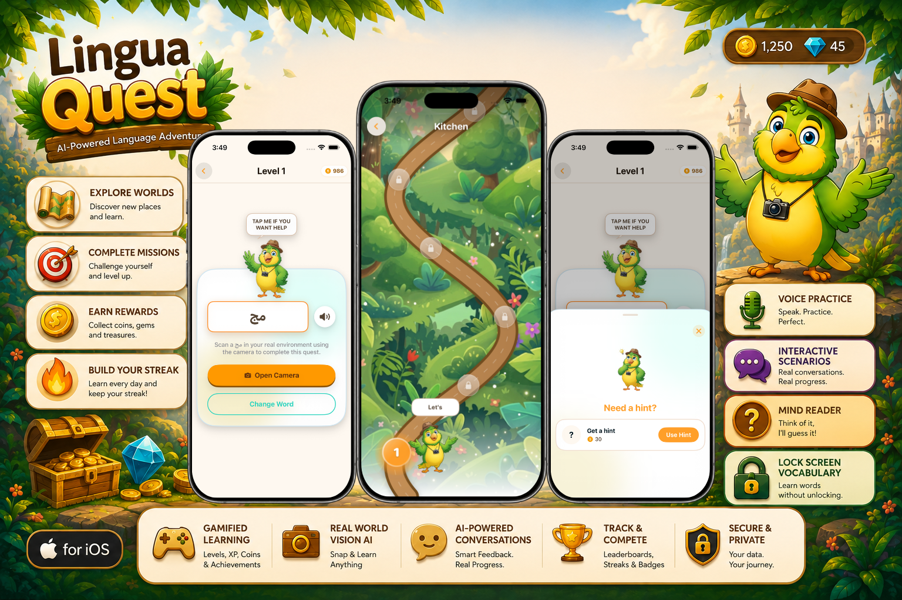
  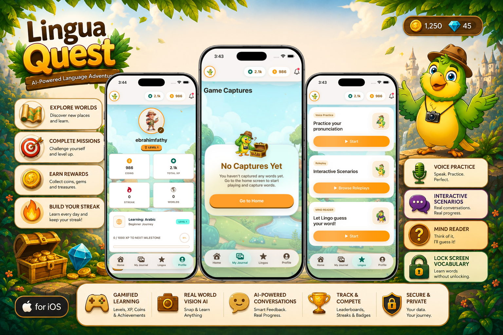
  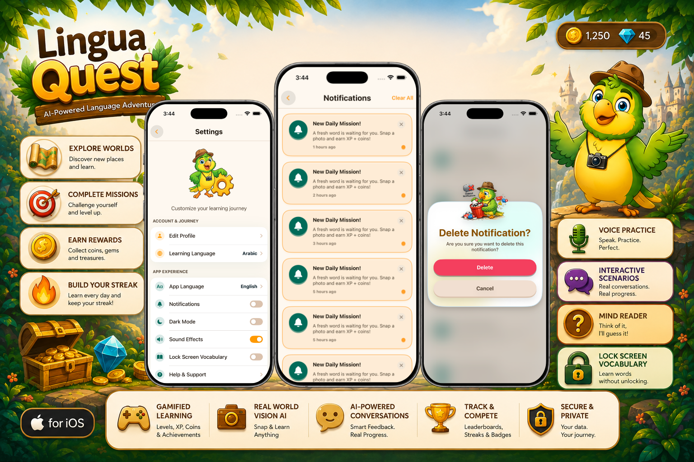
  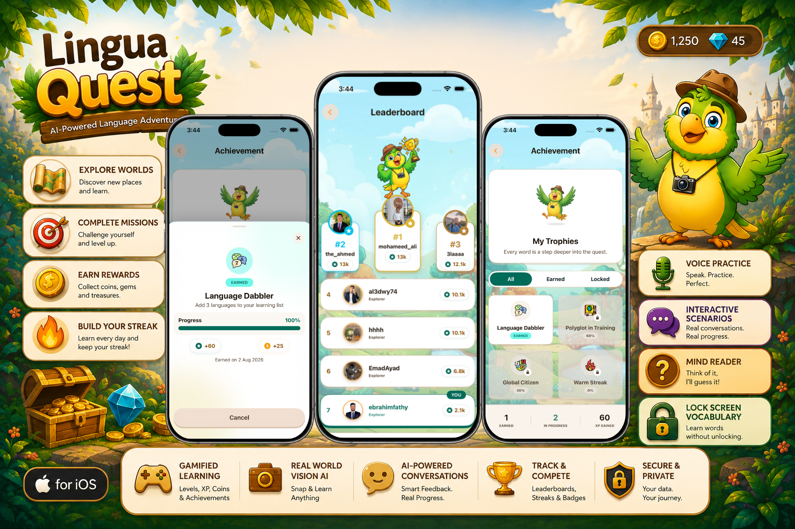
</p>
<p align="center">
  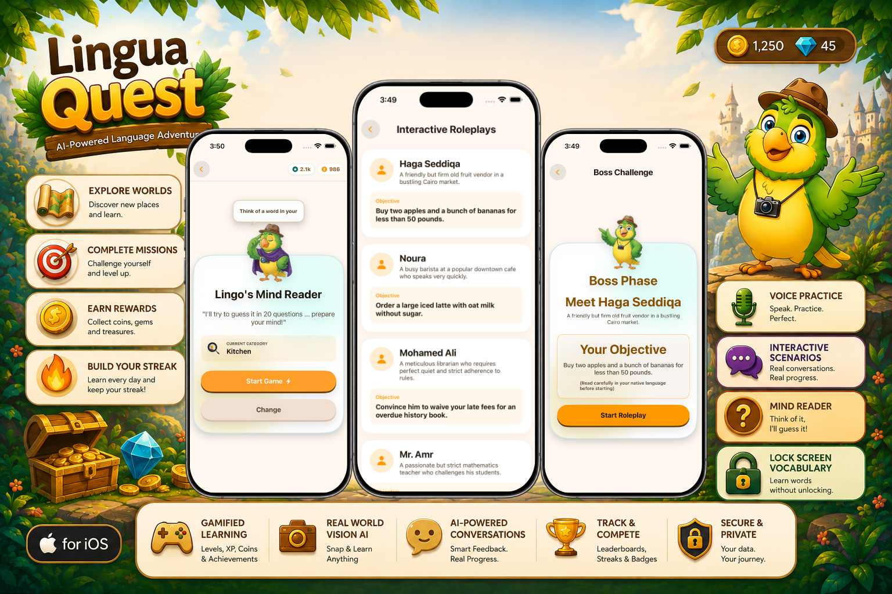
</p>

## 🌟 Comprehensive Feature Breakdown

```
                               ┌────────────────────────────────────────────────┐
                               │                  LINGUA QUEST                  │
                               └───────────────────────┬────────────────────────┘
                                                       │
         ┌─────────────────────┬───────────────────────┼───────────────────────┬─────────────────────┐
         ▼                     ▼                       ▼                       ▼                     ▼
 ┌───────────────┐     ┌───────────────┐       ┌───────────────┐       ┌───────────────┐     ┌───────────────┐
 │   HOME TAB    │     │ MY JOURNAL    │       │  LINGOS TAB   │       │  PROFILE TAB  │     │  LOCK SCREEN  │
 │  (RPG Worlds  │     │ (Vision AI &  │       │ (3 AI Games / │       │(Stats, Badges,│     │ (ActivityKit  │
 │  & Missions)  │     │  Word Bank)   │       │ Voice Lab)    │       │ Leaderboard)  │     │ Live Activity)│
 └───────────────┘     └───────────────┘       └───────────────┘       └───────────────┘     └───────────────┘
```

---

### 🗺️ 1. Home Tab (`Home` & `Game` Modules) — API-Driven

The Home tab orchestrates the structured RPG progression:

- **Active Learning Banner (`LearningCardView`)**:
  - Displays the active target language with flag emoji, current level, streak count, and progress bar.
  - Multi-language switching on the fly with independent state caches.
- **Current Lesson & Object Detection Card (`HomeCurrentLessonSection`)**:
  - Displays `ObjectDetectionCardView` connecting to the next structured level `/worlds/continue-level`.
  - Displays `DailyMissionCard` for daily quests with coin and XP rewards.
- **Explore Worlds & Milestone Map (`HomeExploreWorldsSection`)**:
  - Renders RPG worlds, interactive level nodes, boss checkpoints, and locked/unlocked paths fetched from the Backend API (`/worlds/{worldId}/levels`).
- **Main Game Engine (`Game` Module)**:
  - Supports multiple question types: Multiple Choice, Word Ordering, Translation, Card Matching, and Image Verification (`/worlds/{worldId}/levels/{levelId}/start`).
  - Includes hint system (`/hint`), word replacement (`/change-word`), combo counters, lives/hearts management, and victory celebrations.

---

### 🦉 2. Lingos Tab (3 AI-Powered Interactive Games) — Direct AI Integration

The **Lingos** tab hosts three interactive mini-games that run **directly via AI endpoints and Speech Recognition without standard CRUD backend tables**:

```
                       ┌──────────────────────────────────────────────────┐
                       │                   LINGOS TAB                     │
                       └────────────────────────┬─────────────────────────┘
                                                │
         ┌──────────────────────────────────────┼──────────────────────────────────────┐
         ▼                                      ▼                                      ▼
┌───────────────────────────────┐    ┌──────────────────────────────────┐   ┌──────────────────────────────────┐
│       1. VOICE PRACTICE       │    │      2. INTERACTIVE SCENARIOS    │   │        3. MIND READER            │
│        (Speaking Lab)         │    │           (Boss Level)           │   │          (El-3araf)              │
│ ───────────────────────────── │    │ ──────────────────────────────── │   │ ──────────────────────────────── │
│ • On-the-fly Sentence Gen     │    │ • Push-to-Talk Audio Stream      │   │ • 20-Questions Akinator Engine   │
│ • Speech-to-Text Recognition  │    │ • Multi-turn Gemini AI Dialog    │   │ • Probability-Halving AI Prompts │
│ • AI Phonetic Pronunciation   │    │ • Evaluation: Grammar, Vocab,    │   │ • Mascot Emotional Reactions     │
│   Accuracy Scoring            │    │   and Contextual Relevance       │   │ • Dynamic Emoji & Word Guessing  │
└───────────────────────────────┘    └──────────────────────────────────┘   └──────────────────────────────────┘
```

1. **Voice Practice (`SpeakingLab`)**:
   - **Sentence Generation**: Dynamically generates practice sentences in the target language based on difficulty via generative AI prompts (`VoiceSentenceGeneratorEndpoint`).
   - **Speech Assessment**: Captures user speech using `AVAudioEngine` & Apple `Speech` framework, sending phonetic audio data to the AI evaluation endpoint (`VoiceEvaluationEndpoint`) for accuracy and fluency grading.
2. **Interactive Scenarios / Roleplay (`BossLevel`)**:
   - **Live Conversational AI**: Real-time dialogue scenarios (Airport, Restaurant, Job Interview, Medieval Quest) driven by `LiveRoleplayService` and `GeminiEvaluationService`.
   - **Hold-to-Talk Interaction**: Speech stream recorded live, transcribed into user dialogue bubbles, with audio response playback from the AI partner.
   - **Comprehensive Scoring**: Post-game evaluation across grammar precision, vocabulary richness, and context responsiveness.
3. **Mind Reader / "العراف" (`MindReader`)**:
   - **20-Questions AI Guessing Engine**: The user thinks of a word/object in the target language, and the AI asks strategic Yes/No/Maybe questions (`MindReaderNextStepEndpoint`).
   - **Adaptive Logic**: Narrows possibilities logically with every turn, stops early when confident, and provides matching visual emoji representations with mascot animations.

---

### 📱 3. Lock Screen Vocabulary (`LockScreenVocabulary` & `WordWidget`) — ActivityKit & SwiftData

A micro-learning system designed to teach words without unlocking the iPhone:

- **AI Vocabulary Synthesis**: Uses `VocabularyGeneratorEndpoint` (powered by DeepSeek / Gemini `/chat` endpoint) to synthesize new vocabulary words, definitions, and contextual sentences in the target language.
- **Local Persistence (`SwiftData`)**: Saves generated words locally in `VocabularyWordSwiftDataEntity` with difficulty flags (`Easy`, `Medium`, `Hard`).
- **iOS Live Activity (`WordWidgetLiveActivity`)**:
  - Leverages **ActivityKit** and **WidgetKit** to display interactive vocabulary flashcards directly on the Lock Screen and Dynamic Island.
  - Interactive flip controls to reveal definitions and example sentences.
- **Deep Linking**: Tapping a widget card opens the app via `linguaquest://word?id={UUID}` directly into `WordInsightView`.

---

### 📸 4. My Journal (`Gallery` Module) — Vision AI & SwiftData

The Journal tab acts as the learner's personal vocabulary archive with two dedicated views:

1. **Game Captures (`capturesTab`)**:
   - **Real-World Vision Camera**: Uses the device camera or photo library with CoreML/Vision object detection (`Snap & Learn`).
   - **Visual Dictionary**: Detected real-world objects are translated into the target language with pronunciation audio and persisted in SwiftData (`CapturedItemEntity`).
2. **My Words (`wordsTab`)**:
   - Available when Lock Screen Vocabulary is activated.
   - Displays all mastered and generated vocabulary words.
   - Includes difficulty filtering (`All`, `Easy`, `Medium`, `Hard`) and deep word analytics in `WordInsightView`.

---

### 🔐 5. Authentication & OAuth (`Auth` Module)

- **Multiple Sign-In Providers**:
  - **Email & Password**: Includes registration, OTP email verification (`VerifyEmailViewModel`), and password reset flows (`ForgetPasswordViewModel`, `ResetPasswordViewModel`).
  - **Google Sign-In (`GIDSignIn`)**: Seamless native Google OAuth sign-in flow.
  - **Sign in with Apple (`AuthenticationServices`)**: Native biometric Apple ID authorization.
- **Security & Session Management**:
  - **Firebase AppCheck**: Debug & App Attest providers preventing unauthorized API abuse.
  - **User-Isolated Storage**: `UserPreferences` scopes caches and settings to individual user IDs.
  - **Automatic Token Refresh**: Transparent JWT renewal via `AuthTokenProviding` interceptor in `APIClient`.

---

### 🔔 6. Notifications Architecture (`Notifications` & `AppDelegate`)

- **Remote Push Notifications (APNs & FCM)**:
  - Firebase Cloud Messaging (`MessagingDelegate`) with APNs device token registration.
  - Foreground banner presentation handler (`userNotificationCenter(_:willPresent:)`).
  - Deep link routing on tap via `PushNotificationTapped` notification broadcasts.
- **Local Scheduled Notifications**:
  - Daily practice reminders and streak protection alerts.
  - Periodic background prompts to review Lock Screen vocabulary words.

---

### 🏆 7. Profile, Stats & Settings (`Profile` Module)

- **Learner Stats**: Live balances for coins, gems, total XP, streak counter, and unlocked worlds via `StatsService`.
- **Achievements & Badges**: Showcase earned milestone trophies (Wild Explorer, Perfect Week, etc.) with custom bottom sheets.
- **Global & Language Leaderboard**: Real-time explorer rankings per target language.
- **Avatar Photo Upload**: Client-side image resizing and compression (`UIImage.resizedForAvatar`) with instant URL resolution and caching.
- **Optimized Caching**: Tab switching does not trigger redundant network loads; data only refetches on first launch or when the target learning language changes.

---

## 🏛️ Architecture Overview

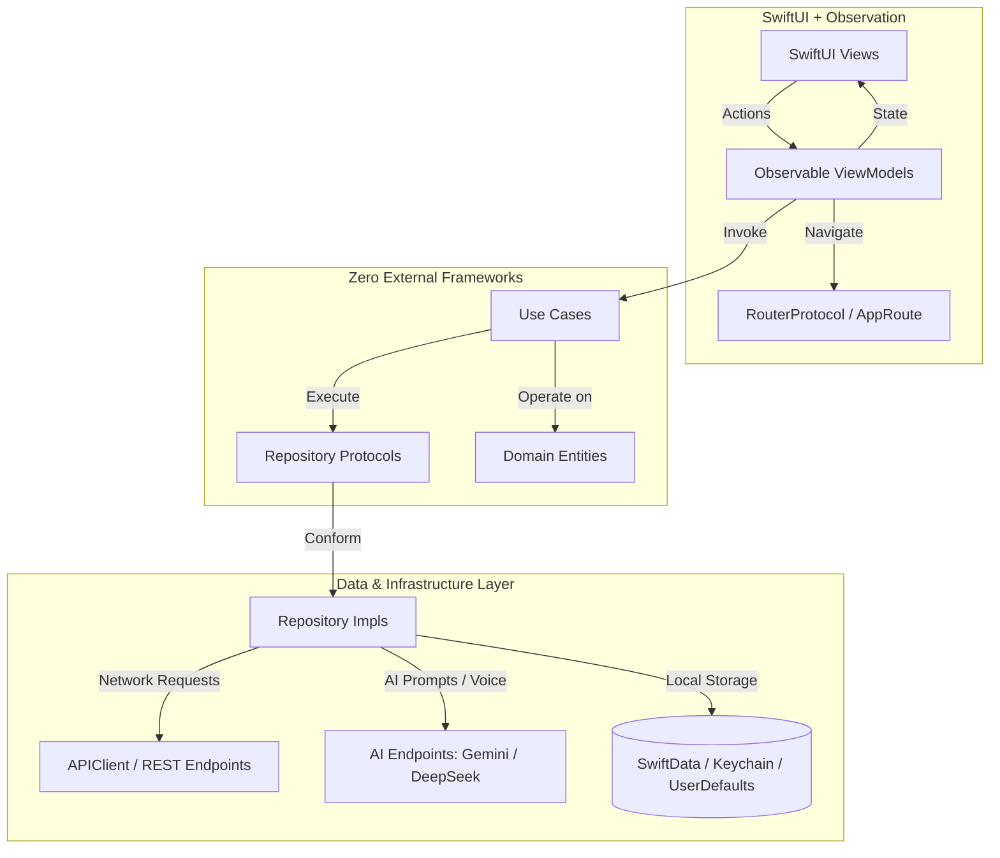

---

## 🛠️ Technology Stack

| Category | Component / Library | Purpose |
|---|---|---|
| **Language & SDK** | Swift 5.9 / 6.0, iOS 17.0+ | Modern Swift concurrency & Observation |
| **User Interface** | SwiftUI, SF Symbols | Declarative UI with custom design system |
| **Dependency Injection** | [Swinject](https://github.com/Swinject/Swinject) | Modular assemblies in `Resolver.swift` |
| **Lock Screen Widgets** | ActivityKit, WidgetKit, AppIntents | Live Activities & Dynamic Island cards |
| **AI & Generative LLM** | Google Gemini API, DeepSeek | Conversational Roleplay, Mind Reader, Vocab Gen |
| **Audio & Speech** | AVFoundation, Speech Framework | Push-to-talk recording, speech recognition, audio SFX |
| **Vision & Camera** | Vision Framework, CoreML | Real-world object detection and translation |
| **Local Persistence** | SwiftData, Keychain, UserDefaults | Offline captures, words, tokens, preferences |
| **Authentication & Cloud** | Firebase Core, AppCheck, GoogleSignIn, Apple ID | Multi-provider OAuth and API security |
| **Networking** | Custom Async/Await `APIClientProtocol` | Generic requests, JWT refresh, multi-part uploads |
| **Localization (i18n)** | `L10n.swift`, `.lproj` string catalogs | English (LTR) & Arabic (RTL) full support |

---

## 📂 Project Directory Structure

```
Lingua Quest/
├── App/
│   ├── Lingua_QuestApp.swift       # Main App lifecycle & SwiftData containers
│   ├── AppDelegate.swift           # Firebase & Push notification handlers
│   ├── AppConfig.swift             # Dynamic URL and API Key resolver
│   └── Resources/                  # Assets, Colors, LaunchScreen, Sounds
├── Core/
│   ├── DI/                         # Swinject container & Resolver
│   ├── Extensions/                 # Swift extensions (Color, View, Notification)
│   ├── Localization/               # L10n accessors & Localizable.strings (ar/en)
│   ├── Network/                    # Base APIClient, Endpoint, NetworkError
│   ├── Routing/                    # Centralized Router, AppRoute & AppSheet
│   ├── Services/                   # StatsService, SessionManager, AppSoundPlayer
│   ├── Shared/                     # Custom dialogs, buttons, bottom sheets
│   ├── Storage/                    # KeychainStorage, SwiftData entities
│   └── Theme/                      # AppColor, AppTextStyle, AppSpacing
├── Modules/
│   ├── Auth/                       # Login, SignUp, OTP, Google & Apple OAuth
│   ├── BossLevel/                  # AI Conversational Voice Roleplay (Gemini)
│   ├── DailyMission/               # Daily quests, streak claims, mission cards
│   ├── Gallery/                    # My Journal (Camera Captures & My Words)
│   ├── Game/                       # Main API-driven RPG quiz & lesson engine
│   ├── Home/                       # Learning progress, world map, lesson carousel
│   ├── Lingos/                     # Mascot hub (SpeakingLab, BossLevel, MindReader)
│   ├── LockScreenVocabulary/       # AI Vocab generation & ActivityKit controller
│   ├── MindReader/                 # 20-Questions AI guessing game (El-3araf)
│   ├── Notifications/              # Local notification scheduling & remote push
│   ├── OnBoarding/                 # Welcome flow & language proficiency picker
│   ├── Profile/                    # User stats, achievements, leaderboard, settings
│   └── SpeakingLab/                # AI Pronunciation & Voice Practice Lab
└── WordWidget/                     # Live Activity & WidgetKit Extension
```

---

## 🚀 Getting Started & Configuration

### Prerequisites
- **macOS Sonoma 14.0+**
- **Xcode 15.0+**
- iOS 17.0+ Simulator or Physical Device

### Quick Setup

1. **Clone the Repository:**
   ```bash
   git clone https://github.com/LinguaQuest-AI-Powered/LinguaQuest-Ios-App.git
   cd LinguaQuest-Ios-App
   ```

2. **Configure Environment (`Config.xcconfig`):**
   ```bash
   cp "Lingua Quest/App/Config.xcconfig.template" "Lingua Quest/App/Config.xcconfig"
   ```
   Edit `Config.xcconfig` with your backend server URLs and AI API keys:
   ```xcconfig
   API_BASE_URL = api.yourserver.com
   AI_BASE_URL = ai.yourserver.com
   GEMINI_API_KEY = your_gemini_api_key_here
   ```

3. **Firebase Configuration:**
   - Place your `GoogleService-Info.plist` inside `Lingua Quest/App/Resources/`.

4. **Build & Run:**
   - Open `Lingua Quest.xcodeproj` in Xcode.
   - Select the **Lingua Quest** scheme.
   - Build and run (`Cmd + R`) on an iOS 17+ device or simulator!

---

## 📄 License & Confidentiality

This project is proprietary and confidential. Unauthorized copying, distribution, or reverse-engineering via any medium is strictly prohibited.

<p align="center">
  Developed with ❤️ by the <b>Lingua Quest Team</b>
</p>
